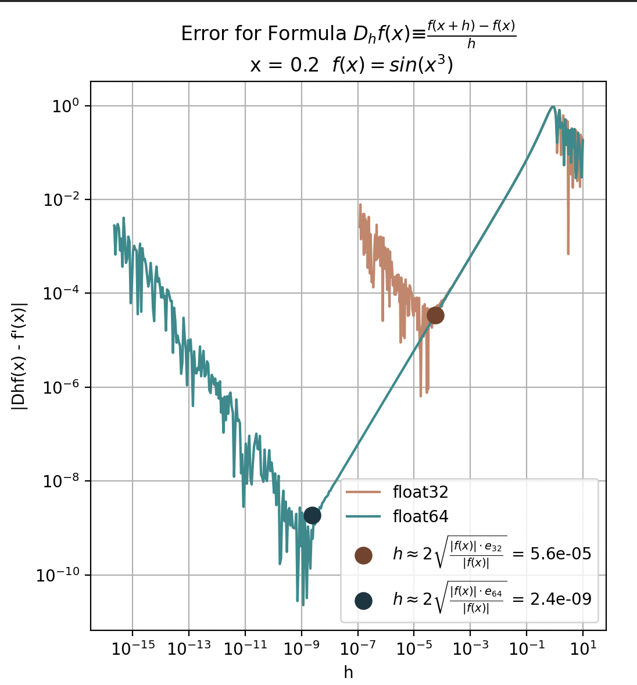
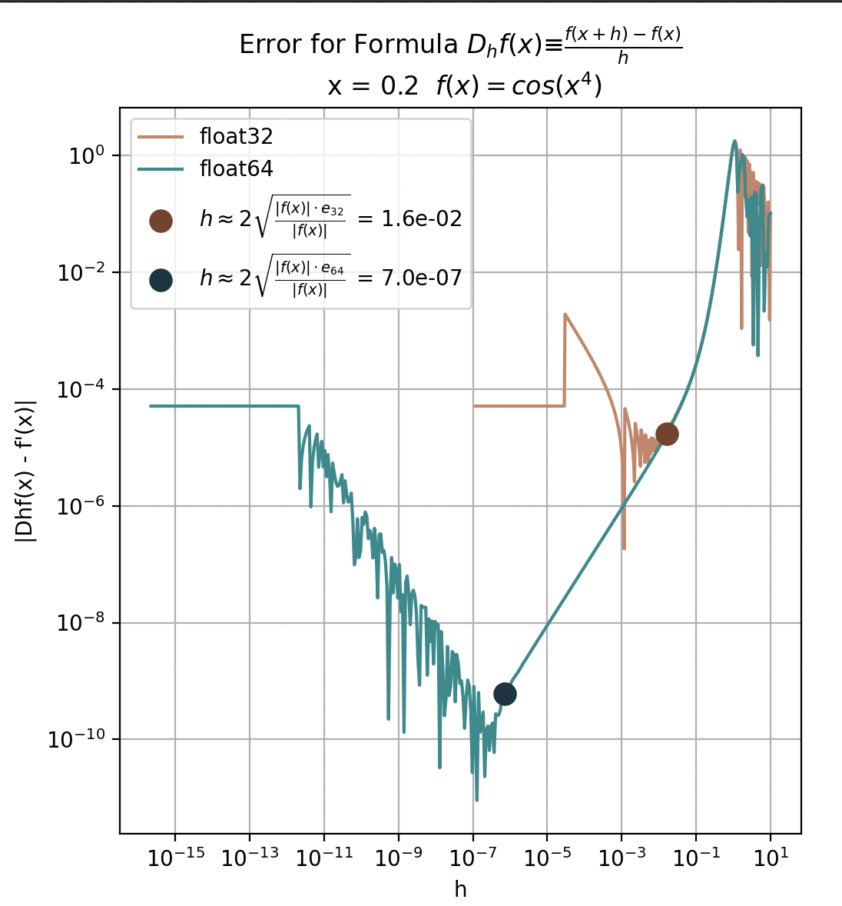
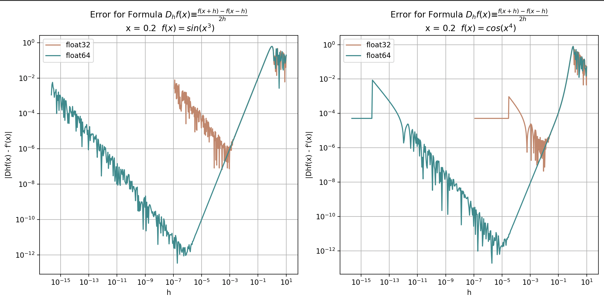

### Cel

Napisz program wyliczający przybliżenie pochodnej ze wzorów:

a)

$$
D_{h}f(x) ≡ \frac{f(x+h)−f(x)}{h}
$$

b)

$$
D_{h}f(x) ≡ \frac{f(x+h)−f(x - h)}{2h}
$$

Przeanalizuj, jak zachowuje się błąd $|D_hf(x)−f′(x)|$ dla funkcji $f(x) = sin(x^3)$
oraz punktu x = 0.2 przy zmianie parametru h dla różnych typów zmiennoprzecinkowych
(float, double). Wykreśl $|D_hf(x) − f′(x)|$ w funkcji h w skali logarytmicznej.

Poeksperymentuj również używając innych funkcji i punktów.

### Analiza błędu

Ze względu na fakt, że liczby z rozwinięciem dziesiętnym w systemie komputerowym są reprezentowane ze skończoną dokładnością, wszelkie obliczenia na nich są obarczone błędem $e$ związanym bezpośrednio z używanym typem danych (double,float).
Wzór $D_{h}f(x) ≡ \frac{f(x+h)−f(x)}{h}$, po uwzględnieniu zaburzeń numerycznych, przyjmie zatem postać:

$D_{h}^{'}f(x) ≡ \frac{f(x+h)\cdot (1+e_1)−f(x)\cdot (1+e_2)}{h}$

Przekształcając:

$$D_{h}^{'}f(x) ≡ \frac{f(x+h)−f(x)}{h} + \frac{f(x+h)\cdot e_1−f(x)\cdot e_2}{h}$$

Rozwińmy $f(x+h)$ w szereg Taylora w pierwszym ułamku, w drugim (zakładając $h \rightarrow 0$) użyjemy przybliżenia $f(x+h) \approx f(x)$.

$$D_{h}^{'}f(x) \approx \frac{f(x) + f'(x)h + \frac{1}{2}f''(x)\cdot h^2 −f(x)}{h} + \frac{f(x)\cdot e_1−f(x)\cdot e_2}{h}$$
$$ \approx f'(x) + \frac{1}{2}f''(x)\cdot h + \frac{f(x)\cdot (e_1 - e_2) }{h}$$

Błąd względny będzie miał zatem postać: $E(h) = |D_{h}^{'}f(x) - f'(x)|$

$$
D_{h}^{'}f(x) - f'(x) \approx \frac{1}{2}f''(x)\cdot h + \frac{f(x)\cdot (e_1 - e_2) }{h}
$$

Zakładając $h>0$:

$$
E(h)  \lesssim \frac{1}{2}|f''(x)|\cdot h + \frac{|f(x)| \cdot |e_1| + |e_2|}{h}
$$

$e_1 \approx e_2 \approx e$

$$
E(h)  \lesssim \frac{1}{2}|f''(x)|\cdot h + \frac{2|f(x)| \cdot e}{h}
$$

Aby znaleźć najlepsze h do wykonania tych obliczeń (czyli takie aby błąd był najmniejszy) musimy znaleźć minimum $E(h)$.

$$
\frac{1}{2}|f''(x)|\cdot h + \frac{2|f(x)| \cdot e}{h}  \equiv 0
$$

$$
 \frac{4|f(x)| \cdot e}{|f''(x)|}  = h^2
$$

$$
 h \approx 2\sqrt{\frac{|f(x)| \cdot e}{|f''(x)|}}
$$

Oczekujemy zatem wyniku obarczonego najmniejszym błędem ok. $2\sqrt{\frac{|f(x)| \cdot e}{|f''(x)|}}$.

### Przebieg

W celu sprawdzenia zależności błędu numerycznego od zaburzenia h napisano program `pochodnaA.py`,
który pokazał ten związek w skali logarytmicznej.

Jak pokazuje wykres, najkorzystniejsze wyniki otrzymamy dla h rzędu $5.6 \cdot 10^{-5}$ dla typu binary 32 oraz $2.4 \cdot 10^{-9}$ dla typu binary 64.

Wykres funkcji ostro rośnie przy coraz większym zwiększaniu lub zmniejszaniu wartości h w stosunku do optymalnej. Dzieje się tak zgodnie ze wzorem:

$$
E(h)  \lesssim \frac{1}{2}|f''(x)|\cdot h + \frac{2|f(x)| \cdot e}{h}
$$

Przy zwiększaniu wartości h na wysokość błędu wpływa czynnim $\frac{1}{2}|f''(x)|\cdot h$ związany z 2 pochodną funkcji używanej do wyliczenia argumentu.

Zmniejszając h, wzrasta watrość $\frac{2|f(x)| \cdot e}{h}$, co przekłada się na wzrost błędu obliczeń.

Zmieniając funkcję na $f(x) = cos(x^4)$ otrzymamy inne wartości optymalnych h, jednak zasada większego błędu w miarę wzrostu odległości $|h - h_{opt}|$ pozostaje niezmieniona. Dokłady program js dostępny w pliku `pochodnaA_inna_funkcja.py`

Dodatkowo, zmieniając metodę obliczania pochodnej na tę z drugiej formuły w programie `pochodnaB.py`, uzyskano zbliżony kształt wykresu do tego z pierwszej metody. Porównując wykresy dokładniej można zaobserwować wzrost optymalnego h dla typu float64 używając metody B.

### Podsumowanie

Analiza błędów numerycznych związanych z obliczaniem pochodnych metodą różnic skończonych wykazała, że optymalne wartości parametru $h$ mają kluczowe znaczenie dla dokładności obliczeń. Wykresy z różnych podejść do obliczeń ukazują, że dla różnych funkcji i typów danych wartość $h$ powinna być starannie dobrana. Zastosowanie drugiej metody różnic centralnych także potwierdza znaczenie tego parametru. Wyniki sugerują, że dobór odpowiedniego $h$ może znacznie poprawić precyzję obliczeń w zadaniach analizy numerycznej.
