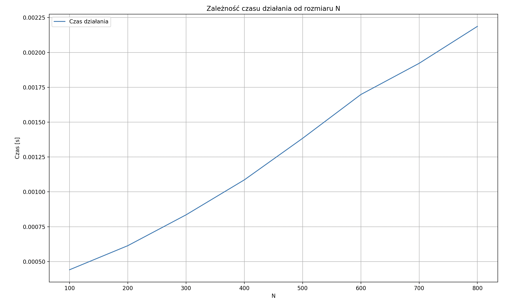

### Cel

Wyznacz $y = A^{−1}x$ dla

$$
A = \begin{pmatrix}
1.01 & \frac{0.2}{1} & \frac{0.15}{1^3} & 0 & 0 & 0 & 0 & 0 & 0 \\
0.3 & 1.01 & \frac{0.2}{2} & \frac{0.15}{2^3} & 0 & 0 & 0 & 0 & 0 \\
0 & 0.3 & 1.01 & \frac{0.2}{3} & \frac{0.15}{3^3} & 0 & 0 & 0 & 0 \\
... & ... & ... & ... & ... & ... & ... & ... & ... \\
0 & 0 & 0 & 0 & 0 & 0.3 & 1.01 & \frac{0.2}{N - 2} & \frac{0.15}{(N-2)^3} \\
0 & 0 & 0 & 0 & 0 & 0 & 0.3 & 1.01 & \frac{0.2}{N - 1} \\
0 & 0 & 0 & 0 & 0 & 0 & 0 & 0.3 & 1.01
\end{pmatrix}
$$

oraz

$$
x = \begin{pmatrix}
1  &  2 & ... & N
\end{pmatrix}^T
$$

Ustalamy N = 300. Oblicz również wyznacznik macierzy A. Zadanie rozwiąż
właściwą metodą (uzasadnij wybór) i wykorzystaj strukturę macierzy.
Ponadto, potraktuj N jako zmienną i zmierz czas działania swojego programu w funkcji N. Wynik przedstaw na wykresie. Jakiej zależności się spodziewamy?

### Analiza układu

W celu rozwiązania równania $y = A^{−1}x$, rozwiążemy równanie $Ay = x$.

Ponieważ A jest macierzą pasmową, posłużymy się algorytmem Thomasa w celu znalezienia faktoryzacji LU macierzy A.

$$
A = LU
$$

gdzie U jest macierzą trójkątną górną, a L macierzą trójkątną dolną, której elementy diagonalne są równe 1.

### Dlaczego algorytm Thomasa?

Algorytm faktoryzacji LU macierzy trójdiagonalnej, wraz z forward substitution i backsubstitution, nosi nazwę algorytmu Thomasa.

Macierz A nie jest co prawda trójdiagonalna, ponieważ ma o jedno pasmo ponad diagonalą za dużo, ale jej struktura jest na tyle zbliżona do macierzy trójdiagonalnej, że możemy zastosować algorytm Thomasa w delikatnie zmodyfikowanej formie. Ze względu na konieczność zachowania kształtu macierzy, niemożliwy jest przy tym wybór elementu podstawowego.

Faktoryzacji LU macierzy trójdiagonalnej można
dokonać w czasie liniowym. Istotnie, gdy obliczamy elementy $l_{ij}, i > j$, widzimy, że dla takiej macierzy tylko $l_{n,n+1}  \neq 0$. Pozostałych elementów nie trzeba więc obliczać, skoro z góry wiadomo, że znikają. Czynnik $L$ jest
dwudiagonalny, podobnie czynnik $U$ zachowa strukturę macierzy A ponad diagonalą, a zatem także
forward substitution i backsubstitution można wykonać w czasie liniowym.

Złożoność obliczeniowa rozwiązywania układu równań z tą macierzą wynosi O(N),zatem jest to jeden z najszybszych algorytmów dla tego rodzaju macierzy.

### Przebieg zadania

Ponieważ A jest macierzą pasmową, możemy ją charakteryzować przez ilość pasków ($n=1$) pod diagonalą i ($m=2$) nad diagonalą. Rozkład LU zachowuje strukturę macierzy, więc macierze L,U będą miały postacie:

$$
L = \begin{pmatrix}
1 & 0 & 0 & 0 & 0 & 0 & 0 & 0 & 0 \\
l_{2,1} & 1 & 0 & 0 & 0 & 0 & 0 & 0 & 0 \\
0 & l_{3,2} & 1 & 0 & 0 & 0 & 0 & 0 & 0 \\
... & ... & ... & ... & ... & ... & ... & ... & ... \\
0 & 0 & 0 & 0 & 0 & l_{N-2,N-3} & 1 & 0 & 0 \\
0 & 0 & 0 & 0 & 0 & 0 & l_{N-1,N-2} & 1 & 0 \\
0 & 0 & 0 & 0 & 0 & 0 & 0 & l_{N,N-1} & 1
\end{pmatrix}
$$

$$
U = \begin{pmatrix}
u_{1,1} & u_{1,2} & u_{1,3} & 0 & 0 & 0 & 0 & 0 & 0 \\
0 & u_{2,2} & u_{2,3} & u_{2,4} & 0 & 0 & 0 & 0 & 0 \\
0 & 0 & u_{3,3} & u_{3,4}& u_{3,5} & 0 & 0 & 0 & 0 \\
... & ... & ... & ... & ... & ... & ... & ... & ... \\
0 & 0 & 0 & 0 & 0 & 0 & u_{N-2,N-2} & u_{N-2,N-1} & u_{N-2,N} \\
0 & 0 & 0 & 0 & 0 & 0 & 0 & u_{N-1,N-1} & u_{N-1,N} \\
0 & 0 & 0 & 0 & 0 & 0 & 0 & 0 & u_{N,N}
\end{pmatrix}
$$

Niezerowe elementy macierzy L i U to: $u_{i,i}, u_{i,i+1}, u_{i,i+2}, l_{i+1,i}$ oraz $l_{i,i} = 1$.

Zgodnie ze wzorami wynikającymi z mnożenia macierzy, niezerowe elementy $u_{i,j}$ i $l_{i,j}$ są dane wzorami:

$$
u_{1,j} = a_{1,j}
$$

dla i>1:

$$
u_{i,i} = a_{i,i} - l_{i,i-1} \cdot u_{i-1,i}
$$

$$
u_{i,i+1} = a_{i,i+1} - l_{i,i-1} \cdot u_{i-1,i+1}
$$

$$
u_{i,i+2} = a_{i,i+2}
$$

$$
l_{i+1,i} = \frac{a_{i+1,i}}{u_{i,i}}
$$

Znając rozkład LU macierzy A, możemy policzyć wyznacznik tej macierzy.

$$
det(A) = det(LU) = det(L) \cdot det(U)
$$

Wyznacznik macierzy trójkątnej jest równy iloczynowi elementów diagonalnych tej macierzy.

$$
det(A) = 1 \cdot \prod_{i=1}^{N=300} U_{i,i}
$$

Następnie rozwiążemy układ równań:

$$
\left\{\begin{array}{rcl}
Uy &=& z\\
Lz&=&x
\end{array} \right.
$$

Najpierw rozwiążemy równanie $Lz = x$ metodą forward substitution. (i>1)

$$
\left\{\begin{array}{rcl}
z_1 &=& x_1\\
z_i&=&x_i - l_{i,i-1}\cdot z_{i-1}
\end{array} \right.
$$

Natomiast równanie $Uy = z$ rozwiążemy metodą backsubstitution: (i>1)

$$
\left\{\begin{array}{rcl}
y_N &=& \frac{z_N}{u_{N,N}}\\
y_{N-1}&=&\frac{z_{N-1} - u_{N-1,N}\cdot y_{N}}{u_{N,N}}\\
y_{N-i}&=&\frac{z_{N-i} - u_{N-i,N-i+2}\cdot y_{N-i+2} - u_{N-i,N-i+1}\cdot y_{N-i+1}}{u_{N-i,N-i}}
\end{array} \right.
$$

Dzięki czemu uzyskamy wektor y będący rozwiązaniem.

### Faktoryzacja LU i rozwiązanie równania z użyciem programu

Macierz A zostanie przechowana w strukturze $H_{4,N}$ w sposób następujący:

$$
H = \begin{pmatrix}
a_{1,3} & a_{2,4}& a_{3,5}& ... & a_{N-2,N} & 0 & 0 \\
a_{1,2} &a_{2,3} & a_{3,4} & ... & a_{N-2,N-1} & a_{N-1,N} & 0\\
a_{1,1} & a_{2,2} & a_{3,3}& ... & a_{N-2,N-2} & a_{N-1,N-1} & a_{N,N} \\
0 & a_{2,1} & a_{3,2} & ... & a_{N-2,N-3} & a_{N-1,N-2} & a_{N,N-1}\\
\end{pmatrix}
$$

$$
H = \begin{pmatrix}
\frac{0.15}{1^3} & \frac{0.15}{2^3}& \frac{0.15}{3^3}& ... & \frac{0.15}{(N-2)^3} & 0 & 0 \\
\frac{0.2}{1} &\frac{0.2}{2} & \frac{0.2}{3} & ... & \frac{0.2}{N-2} & \frac{0.2}{N-1} & 0\\
1.01 & 1.01 & 1.01& ... & 1.01 & 1.01 & 1.01  \\
0 & 0.3 & 0.3 & ... & 0.3 & 0.3 & 0.3\\
\end{pmatrix}
$$

Obliczeń dokonano z użyciem biblioteki pythonowej numpy,
pełny program jest dostępny w pliku `program.py`.

### Wyniki

Policzony wyznacznik macierzy A dla $N = 300$:

$$
det(A) = 9.778753063504471
$$

Wyznaczony wektor $y$ dla $N = 300$ (zaokrąglony do 2 miejsc po przecinku):

$$
y = \begin{bmatrix}
0.30 \\
1.82 \\
2.23 \\
3.15 \\
3.87 \\
4.66 \\
5.42 \\
6.19 \\
6.96 \\
7.72 \\
8.49 \\
9.25 \\
10.02 \\
10.79 \\
11.55 \\
\vdots \\
225.78 \\
226.55 \\
227.31 \\
228.08 \\
228.84 \\
229.76
\end{bmatrix}
$$

Wyznaczona zależność czasu działania programu od rozmiaru N jest liniowa, zgodnie z oczekiwaną.

### Podsumowanie

W zadaniu należało obliczyć wektor $y=A^{−1}x$
dla macierzy pasmowej $A$ oraz wektora $x$ o ustalonym rozmiarze $N=300$.

Macierz $A$ ma strukturę zbliżoną do macierzy trójdiagonalnej, co umożliwiło wykorzystanie algorytmu Thomasa (modyfikacji dla macierzy pasmowych) do przeprowadzenia rozkładu LU. Algorytm ten charakteryzuje się liniową złożonością obliczeniową $O(N)$, co zapewnia szybkie rozwiązanie układu równań dla dużych wartości $N$.

Wynikiem obliczeń był konkretny wektor $y$ oraz wyznacznik macierzy $A$ (około 9.78 dla
$N=300$). Analiza czasu potwierdziła liniową złożoność algorytmu, co jest zgodne z oczekiwaniami dla algorytmów opartych na rozkładzie LU dla macierzy pasmowych.
