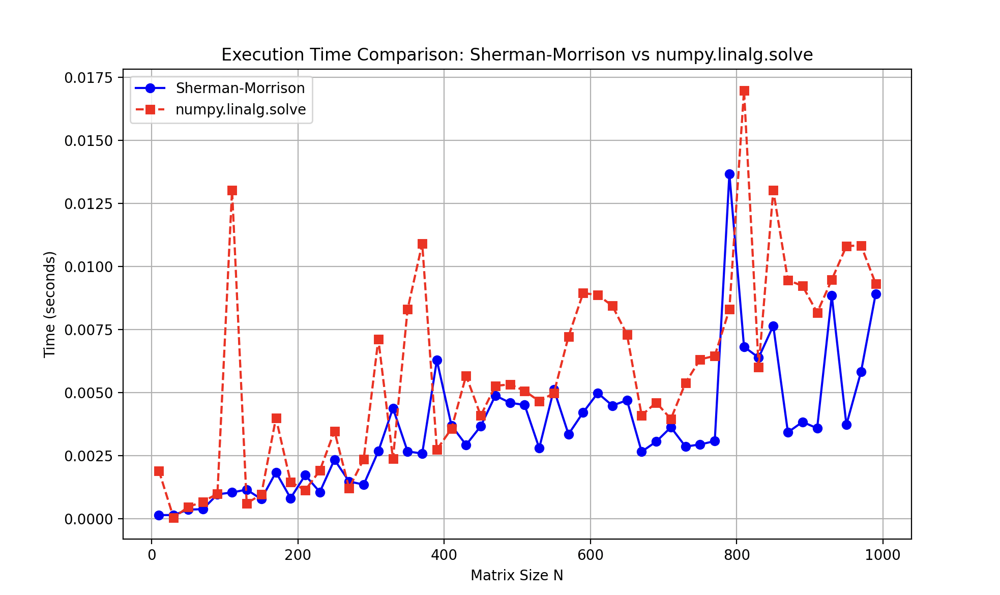

### Cel

Rozwiąż numerycznie równanie $Ay = b$, stosując odpowiednią metodę.
Sprawdź swój wynik przy użyciu procedur bibliotecznych lub pakietów algebry komputerowej, następnie potraktuj N jako zmienną i zmierz czas potrzebny do uzyskania rozwiązania w funkcji N. Wynik
przedstaw na wykresie

### Analiza układu

Dana jest macierz $A_{120x120}$:

$$
A = \begin{pmatrix}
5 & 3 & 1 & 1 & ... & 1 & 1 & 1 & 1 \\
1 & 5 & 3 & 1 & ... & 1 & 1 & 1 & 1 \\
1 & 1 & 5 & 3 & ... & 1 & 1 & 1 & 1 \\
... & ... & ... & ... & ... & ... & ... & ... & ... \\
1 & 1 & 1 & 1 & ... & 1 & 5 & 3 & 1 \\
1 & 1 & 1 & 1 & ... & 1 & 1 & 5 & 3\\
1 & 1 & 1 & 1 & ... & 1 & 1 & 1 & 5
\end{pmatrix}
$$

oraz wektor $b_{1x120}$:

$$
b = \begin{pmatrix}
2 & 2 & 2 & ... & 2
\end{pmatrix}^T
$$

W celu rozwiązania układu $y = A^{-1}b$, posłużymy się algorytmem Shermana-Morrisina.

1. Macierz A zostanie przedstawiona jako suma macierzy pasmowej i iloczynu dwóch wektorów.

$$
A = A_1 + uv^T
$$

$$
u = v = \begin{pmatrix}
1  \\
1\\
1  \\
...  \\
1 \\
1
\end{pmatrix}

$$

$$
A_1 = \begin{pmatrix}
4 & 2 & 0 & 0 & ... &  0 & 0 \\
0 & 4 & 2 & 0 & ... &  0 & 0 \\
0 & 0 & 4 & 2 & ... &  0 & 0 \\
... & ... & ... & ...  & ... & ... & ... \\
0 & 0 & 0 & 0 & ... &  2 & 0 \\
0 & 0 & 0 & 0 & ... &  4 & 2\\
0 & 0 & 0 & 0 & ... &  0 & 4
\end{pmatrix}
$$

$$
uv^T = \begin{pmatrix}
1 & 1 & 1 & 1 & ... &  1 & 1 \\
1 & 1 & 1 & 1 & ... &  1 & 1 \\
1 & 1 & 1 & 1 & ... &  1 & 1 \\
... & ... & ... & ...  & ... & ... & ... \\
1 & 1 & 1 & 1 & ... &  1 & 1 \\
1 & 1 & 1 & 1 & ... &  1 & 1\\
1 & 1 & 1 & 1 & ... &  1 & 1
\end{pmatrix}
$$

Zgodnie ze wzorem Shermana-Morrisona, macierz $A^{-1}$ może zostać przedstawiona jako:

$$
A^{-1} = A_1^{-1} - \frac{A_1^{-1}uv^TA_1^{-1}}{1 + v^TA_1^{-1}u}
$$

Wtedy:

$$
y = A^{-1}b = (A_1^{-1} - \frac{A_1^{-1}uv^TA_1^{-1}}{1 + v^TA_1^{-1}u})b
$$

2. Następnie rozwiążemy układ $A_1z = b$
3. Kolejno układ $A_1q = u$
4. Na koniec obliczymy:
    $$
    y = z - \frac{v^T\cdot z}{1 + v^Tq}q
    $$

Problem ten sprowadza się więc do rozwiązania dwóch równań z taką samą macierzą pasmową. Używając metody backsubstitution czas ich rozwiązania będzie liniowy.

### Rozwiązanie za pomocą programu

Za pomocą programu `program.py` napisanego w pythonie,
uzyskane $y$ dla $N = 120$ wyniosło:

$$
y = [0.01583113 , 0.01583113 , 0.01583113 , 0.01583113 , 0.01583113 , 0.01583113 \\
0.01583113 , 0.01583113 , 0.01583113 , 0.01583113 , 0.01583113 , 0.01583113 \\
0.01583113 , 0.01583113 , 0.01583113 , 0.01583113 , 0.01583113 , 0.01583113\\
0.01583113 , 0.01583113 , 0.01583113 , 0.01583113 , 0.01583113 , 0.01583113\\
0.01583113 , 0.01583113 , 0.01583113 , 0.01583113 , 0.01583113 , 0.01583113\\
0.01583113 , 0.01583113 , 0.01583113 , 0.01583113 , 0.01583113 , 0.01583113\\
0.01583113 , 0.01583113 , 0.01583113 , 0.01583113 , 0.01583113 , 0.01583113\\
0.01583113 , 0.01583113 , 0.01583113 , 0.01583113 , 0.01583113 , 0.01583113\\
0.01583113 , 0.01583113 , 0.01583113 , 0.01583113 , 0.01583113 , 0.01583113\\
0.01583113 , 0.01583113 , 0.01583113 , 0.01583113 , 0.01583113 , 0.01583113\\
0.01583113 , 0.01583113 , 0.01583113 , 0.01583113 , 0.01583113 , 0.01583113\\
0.01583113 , 0.01583113 , 0.01583113 , 0.01583113 , 0.01583113 , 0.01583113\\
0.01583113 , 0.01583113 , 0.01583113 , 0.01583113 , 0.01583113 , 0.01583113\\
0.01583113 , 0.01583113 , 0.01583113 , 0.01583113 , 0.01583113 , 0.01583113\\
0.01583113 , 0.01583113 , 0.01583113 , 0.01583113 , 0.01583113 , 0.01583113\\
0.01583113 , 0.01583113 , 0.01583113 , 0.01583113 , 0.01583113 , 0.01583114\\
0.01583113 , 0.01583114 , 0.01583113 , 0.01583114 , 0.01583112 , 0.01583116\\
0.01583107 , 0.01583126 , 0.01583089 , 0.01583162 , 0.01583017 , 0.01583307\\
0.01582727 , 0.01583886 , 0.01581567 , 0.01586205 , 0.01576929 , 0.01595482\\
0.01558377 , 0.01632586 , 0.01484169 , 0.01781003 , 0.01187335 , 0.0237467 ]^T
$$

Następnie obliczono y ponownie, za pomocą procedury bibliotecznej `numpy.linalg.solve`.

Funkcja ta wykorzystuje LAPACK (Linear Algebra PACKage), czyli wysoce zoptymalizowany zestaw procedur do wykonywania operacji algebry liniowej. LAPACK opiera się na BLAS (Basic Linear Algebra Subprograms), które zajmuje się podstawowymi operacjami, takimi jak mnożenie macierzy i wektorów. W zależności od macierzy A, automatycznie dobierany jest sposób rozwiązania spośród między innymi:

-   Procedury rozkladu LU z częściowym wyborem elementu głównego
-   W przypadku macierzy symetrycznych i dodatnio określonych, LAPACK może użyć rozkladu Choleskiego

Wektor $y'$ obliczony w ten sposób wyniósł:

$$
y' = [0.01583113 , 0.01583113 , 0.01583113 , 0.01583113 , 0.01583113 , 0.01583113 \\
 0.01583113 ,  0.01583113 ,  0.01583113 ,  0.01583113 ,  0.01583113 ,  0.01583113\\
 0.01583113 ,  0.01583113 ,  0.01583113 ,  0.01583113 ,  0.01583113 ,  0.01583113\\
 0.01583113 ,  0.01583113 ,  0.01583113 ,  0.01583113 ,  0.01583113 ,  0.01583113\\
 0.01583113 ,  0.01583113 ,  0.01583113 ,  0.01583113 ,  0.01583113 ,  0.01583113\\
 0.01583113 ,  0.01583113 ,  0.01583113 ,  0.01583113 ,  0.01583113 ,  0.01583113\\
 0.01583113 ,  0.01583113 ,  0.01583113 ,  0.01583113 ,  0.01583113 ,  0.01583113\\
 0.01583113 ,  0.01583113 ,  0.01583113 ,  0.01583113 ,  0.01583113 ,  0.01583113\\
 0.01583113 , 0.01583113 , 0.01583113 , 0.01583113 , 0.01583113 , 0.01583113\\
 0.01583113 , 0.01583113 , 0.01583113 , 0.01583113 , 0.01583113 , 0.01583113\\
 0.01583113 , 0.01583113 , 0.01583113 , 0.01583113 , 0.01583113 , 0.01583113\\
 0.01583113 , 0.01583113 , 0.01583113 , 0.01583113 , 0.01583113 , 0.01583113\\
 0.01583113 , 0.01583113 , 0.01583113 , 0.01583113 , 0.01583113 , 0.01583113\\
 0.01583113 , 0.01583113 , 0.01583113 , 0.01583113 , 0.01583113 , 0.01583113\\
 0.01583113 , 0.01583113 , 0.01583113 , 0.01583113 , 0.01583113 , 0.01583113\\
 0.01583113 , 0.01583113 , 0.01583113 , 0.01583113 , 0.01583113 , 0.01583114\\
 0.01583113 , 0.01583114 , 0.01583113 , 0.01583114 , 0.01583112 , 0.01583116\\
 0.01583107 , 0.01583126 , 0.01583089 , 0.01583162 , 0.01583017 , 0.01583307\\
 0.01582727 , 0.01583886 , 0.01581567 , 0.01586205 , 0.01576929 , 0.01595482\\
 0.01558377 , 0.01632586 , 0.01484169 , 0.01781003 , 0.01187335 , 0.0237467 ]^T
$$

W celu porównania tych dwóch wektorów, obliczono maksymalą bezwzględą różnicę współrzędnych:

$$
max(|y - y'|) =  3.7816971776294395 \cdot 10^{-16}
$$

Dla typu binary64 błąd numeryczny jest rzędu $\epsilon = 2.22\cdot 10^{-16}$.
Błąd w obliczeniu wartości $y$ jest mniejszy niż $2\epsilon$, zatem
wyniki można uznać za zgodne.

### Porównanie obu metod dla różnych wartości $N$

Zbadano jak szybko otrzymamy wynik obiema metodami dla różnych $N$ z przedziału $(10,1000)$.

Zgodnie z oczekiwaniami, obliczanie wektora $y$ dla tego konkretnego przykładu metodą Shermana-Morrisona prowadzi do lepszej złożoności obliczeniowej niż $(O(n^3))$, którą otrzymalibyśmy rozwiązując ten układ metodami dla macierzy gęstych (np. faktoryzacją LU). Dzieje się tak dlatego że powstała macierz $A_1$ jest macierzą pasmową, co wykorzystaliśmy.

Porównując zaś ze sobą metodę biblioteczną `numpy.linalg.solve` oraz napisany przez nas algorytm , możemy zauważyć że osiągają one podobną szybkość dla poszczególnych $N$. Stosowanie więc którejkolwiek z tych dwóch metod będzie w przypadku tego układu równań tak samo optymalne.

### Podsumowanie

W zadaniu rozwiązano układ równań $Ay = b$ dwoma metodami: za pomocą algorytmu Shermana-Morrisona oraz procedury bibliotecznej `numpy.linalg.solve`. Wektor rozwiązania $y$ uzyskany obiema metodami okazał się zgodny z dokładnością rzędu błędu maszynowego, co potwierdza poprawność obliczeń.

Porównano również czas obliczeń w funkcji rozmiaru układu $N$. Dzięki strukturze macierzy pasmowej $A_1$, algorytm Shermana-Morrisona wykazuje lepszą złożoność obliczeniową w porównaniu z ogólnymi metodami rozwiązywania układów równań dla macierzy gęstych. Dla analizowanego przykładu szybkość działania obu metod (Shermana-Morrisona oraz numpy.linalg.solve) była podobna, co wskazuje, że obie nadają się równie dobrze do rozwiązania tego rodzaju problemu.

Optymalność algorytmu Shermana-Morrisona wynika z wykorzystania struktury macierzy pasmowej, co pozwala na znaczną redukcję liczby operacji.
