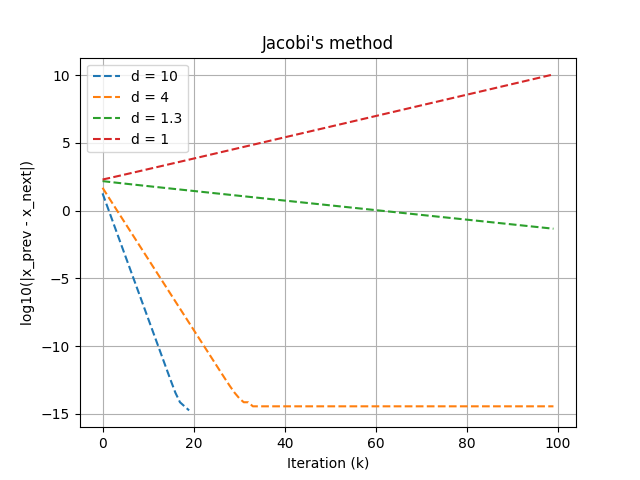
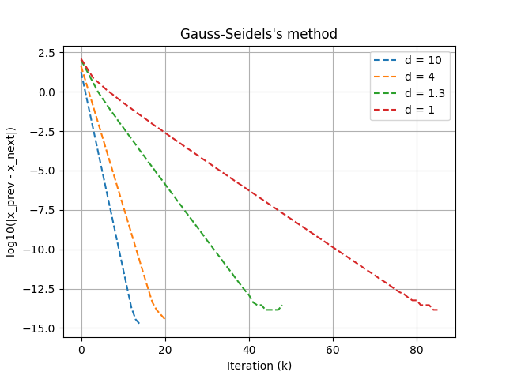
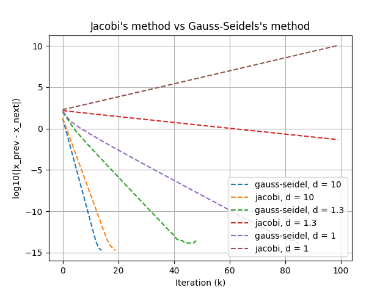

### Cel

Rozwiąż następujący układ równań $Ax = b$:

$$
\begin{pmatrix}
d & 0.5 & 0.1 & 0 & ... & 0 & 0 & 0 & 0 \\
0.5 & d & 0.5 & 0.1 & ... & 0 & 0 & 0 & 0 \\
0.1 & 0.5 & d & 0.5 & ... & 0 & 0 & 0 & 0 \\
... & ... & ... & ... & ... & ... & ... & ... & ... \\
0 & 0 & 0 & 0 & ... & 0.5 & d & 0.5 & 0.1 \\
0 & 0 & 0 & 0 & ... & 0.1 & 0.5 & d & 0.5\\
0 & 0 & 0 & 0 & ... & 0 & 0.1 & 0.5 & d
\end{pmatrix} \cdot x = \begin{pmatrix} 1\\ 2\\ 3\\ ...\\ N-2\\ N-1\\ N\end{pmatrix}
$$

dla N = 200 za pomocą metod Jacobiego i Gaussa-Seidela, gdzie d jest elementem diagonalnym. Dla
różnych wartości d i punktów startowych przedstaw graficznie różnicę pomiędzy dokładnym rozwiązaniem
a jego przybliżeniami w kolejnych iteracjach. Odpowiednio dobierając zakres parametrów, porównaj dwie
metody. Czy procedura iteracyjna zawsze jest zbieżna?

### Wstęp teoretyczny

Układ równań postaci $Ax = b$ rozwiązujemy iteracyjnie, jeśli zastosowanie faktoryzacji prowadziłoby do wypełnienia macierzy rzadkiej. Zostaną do tego celu użyte dwie metody, Jackobiego oraz Gaussa-Seidela.

Metodę Jacobiego można zapisać za pomocą następującego równania:
(Górny indeks $x^{(k)}$ oznacza, ze jest to przyblizenie w k-tym kroku.)

$$
x^{(k+1)}_i = (b_i - \sum_{j=1}^{i-1} a_{ij}x_j^{(k)} - \sum_{j=i+1}^{N} a_{ij}x_j^{(k)})/a_{i,i}
$$

Metoda Gaussa-Seidela:

$$
x^{(k+1)}_i = (b_i - \sum_{j=1}^{i-1} a_{ij}x_j^{(k+1)} - \sum_{j=i+1}^{N} a_{ij}x_j^{(k)})/a_{i,i}
$$

Metody Jacobiego i Gaussa-Seidela nalezą do ogólnej kategorii

$$
Mx^{(k+1)} = Nx^{(k)} + b
$$

gdzie A = M − N jest podziałem macierzy. Dla metody Jacobiego M = D (częsć diagonalna), N = −(L + U) (częsci pod- i ponaddiagonalne, bez przekątnej). Dla metody Gaussa-Seidela M = D + L, N = −U. Rozwiązanie równania Ax = b jest punktem stałym iteracji.

Metoda Jacobiego jest zbiezna, jeśli macierz A jest silnie
diagonalnie dominująca, to znaczy jesli wartości bezwzględne elementów na głównej przekątnej są większe od sumy wartosci bezwzględnych pozostałych elementów w danym wierszu.

Metoda Gaussa-Seidela jest zbiezna, jeśli macierz A jest
symetryczna i dodatnio okreslona.

### Metoda Jacobiego

Ze struktury macierzy A możemy wydzielić 3 macierze:

-   D - zawiera jedynie elementy diagonalne $a_{i,i}$
-   L - zawiera jedtnie elementy poddiagonalne $a_{i,j}$ $j<i$
-   U - zawiera jedtnie elementy naddiagonalne $a_{i,j}$ $j>i$

$$
A  = D + L + U = D - (- L - U)
$$

$$
Dx^{(k+1)} = −(L + U)x^{(k)} + b
$$

$$
Dx^{(k+1)} = b − Lx^{(k)} - Ux^{(k)}
$$

Następnie rozpisując mnożenia macierzowe otrzymujemy:

$$
d_{i,i}x_i^{(k+1)} = b − \sum_{j=1}^{i-1} l_{i,j}x_j^{(k)} - \sum_{j = i+1}^{N} u_{i,j}x_j^{(k)}
$$

Uwzględniając strukturę macierzy pasmowej A:

$$
d_{i,i}x_i^{(k+1)} = b − \sum_{j=i-2}^{i-1} l_{i,j}x_j^{(k)} - \sum_{j = i+1}^{j+2} u_{i,j}x_j^{(k)}
$$

Przechodząc na indeksy macierzy A otrzymujemy:

(jeśli $a_{i,x}$ nie istnieje to znaczy że jest równe 0)

$$
x_i^{(k+1)} = (b − a_{i,i-2}x_{i-2}^{(k)} − a_{i,i-1}x_{i-1}^{(k)} - a_{i,i+1}x_{i+1}^{(k)} - a_{i,i+2}x_{i+2}^{(k)})a_{i,i}
$$

Metoda ta jest zbieżna jeżeli macierz jest silnie diagonalnie zbieżna, czyli:

$$
|a_{i,i}| > \sum_{i\neq j } |a_{i,j}|
$$

W tym przypadku $max(\sum_{i\neq j } |a_{i,j}|)$ = 1.2, zatem
zbieżność metody będzie zachodziła dla $d>1.2$.

### Metoda Gaussa-Seidela

Metoda Gaussa-Seidela jest zbiezna, jeśli macierz A jest
symetryczna i dodatnio okreslona. Powinna zatem zbiegać niezależnie od wyboru d, o ile zachowana zostanie dodatnia określoność.

Dzięki temu że macierz A określona jest jako:

$$
A = M  - N
$$

gdzie
$M = D + L$ a $N = −U$, kolejne generacje składowych wektora $x$ obliczane są również z użyciem elementów obliczonych w tej samej generacji.

$$
x^{(k+1)}_i = (b_i - \sum_{j=1}^{i-1} a_{ij}x_j^{(k+1)} - \sum_{j=i+1}^{N} a_{ij}x_j^{(k)})/a_{i,i}
$$

Uwzględniając pasmową strukturę macierzy:

$$
x^{(k+1)}_i = (b_i - \sum_{j=i-2}^{i-1} a_{ij}x_j^{(k+1)} - \sum_{j=i+1}^{i+2} a_{ij}x_j^{(k)})/a_{i,i}
$$

### Rozwiązanie układu metodą Jacobiego

Używając programu napisanego w pythonie: `solver.py` otrzymano dla metody Jacobiego następujący wynik:

x =
[ 0.08839057 0.17861586 0.26786391 0.35714208 0.44642854 0.53571429
0.625 0.71428571 0.80357143 0.89285714 0.98214286 1.07142857
1.16071429 1.25 1.33928571 1.42857143 1.51785714 1.60714286
1.69642857 1.78571429 1.875 1.96428571 2.05357143 2.14285714
2.23214286 2.32142857 2.41071429 2.5 2.58928571 2.67857143
2.76785714 2.85714286 2.94642857 3.03571429 3.125 3.21428571
3.30357143 3.39285714 3.48214286 3.57142857 3.66071429 3.75
3.83928571 3.92857143 4.01785714 4.10714286 4.19642857 4.28571429
4.375 4.46428571 4.55357143 4.64285714 4.73214286 4.82142857
4.91071429 5. 5.08928571 5.17857143 5.26785714 5.35714286
5.44642857 5.53571429 5.625 5.71428571 5.80357143 5.89285714
5.98214286 6.07142857 6.16071429 6.25 6.33928571 6.42857143
6.51785714 6.60714286 6.69642857 6.78571429 6.875 6.96428571
7.05357143 7.14285714 7.23214286 7.32142857 7.41071429 7.5
7.58928571 7.67857143 7.76785714 7.85714286 7.94642857 8.03571429
8.125 8.21428571 8.30357143 8.39285714 8.48214286 8.57142857
8.66071429 8.75 8.83928571 8.92857143 9.01785714 9.10714286
9.19642857 9.28571429 9.375 9.46428571 9.55357143 9.64285714
9.73214286 9.82142857 9.91071429 10. 10.08928571 10.17857143
10.26785714 10.35714286 10.44642857 10.53571429 10.625 10.71428571
10.80357143 10.89285714 10.98214286 11.07142857 11.16071429 11.25
11.33928571 11.42857143 11.51785714 11.60714286 11.69642857 11.78571429
11.875 11.96428571 12.05357143 12.14285714 12.23214286 12.32142857
12.41071429 12.5 12.58928571 12.67857143 12.76785714 12.85714286
12.94642857 13.03571429 13.125 13.21428571 13.30357143 13.39285714
13.48214286 13.57142857 13.66071429 13.75 13.83928571 13.92857143
14.01785714 14.10714286 14.19642857 14.28571429 14.375 14.46428571
14.55357143 14.64285714 14.73214286 14.82142857 14.91071429 15.
15.08928571 15.17857143 15.26785714 15.35714286 15.44642857 15.53571429
15.625 15.71428571 15.80357143 15.89285714 15.98214286 16.07142857
16.16071429 16.25 16.33928571 16.42857143 16.51785714 16.60714286
16.69642857 16.78571429 16.875 16.96428571 17.05357143 17.14285715
17.23214299 17.32142691 17.41070903 17.50019188 17.58886038 17.66153843
17.89460175 18.92865453]

dla d = 10.

Porównano również zbieżność tej metody dla różnych parametrów d.

Zgodznie z oczekiwaniami, zbieżność metody jest tym lepsza, im większa jest różnica :

$$
|a_{i,i}| - \sum_{i\neq j } |a_{i,j}|
$$

czyli im większe jest d od 1.2 . W momencie gdzy d jest bliskie 1.2, zbieżność jest bardzo powolna, a dla d mniejszego od 1.2 metoda jest rozbieżna.

### Rozwiązanie układu metodą Gaussa-Seidela

Używając programu napisanego w pythonie: `solver.py` otrzymano dla metody Gaussa-Seidela następujący wynik:

x = [ 0.08839057 0.17861586 0.26786391 0.35714208 0.44642854 0.53571429
0.625 0.71428571 0.80357143 0.89285714 0.98214286 1.07142857
1.16071429 1.25 1.33928571 1.42857143 1.51785714 1.60714286
1.69642857 1.78571429 1.875 1.96428571 2.05357143 2.14285714
2.23214286 2.32142857 2.41071429 2.5 2.58928571 2.67857143
2.76785714 2.85714286 2.94642857 3.03571429 3.125 3.21428571
3.30357143 3.39285714 3.48214286 3.57142857 3.66071429 3.75
3.83928571 3.92857143 4.01785714 4.10714286 4.19642857 4.28571429
4.375 4.46428571 4.55357143 4.64285714 4.73214286 4.82142857
4.91071429 5. 5.08928571 5.17857143 5.26785714 5.35714286
5.44642857 5.53571429 5.625 5.71428571 5.80357143 5.89285714
5.98214286 6.07142857 6.16071429 6.25 6.33928571 6.42857143
6.51785714 6.60714286 6.69642857 6.78571429 6.875 6.96428571
7.05357143 7.14285714 7.23214286 7.32142857 7.41071429 7.5
7.58928571 7.67857143 7.76785714 7.85714286 7.94642857 8.03571429
8.125 8.21428571 8.30357143 8.39285714 8.48214286 8.57142857
8.66071429 8.75 8.83928571 8.92857143 9.01785714 9.10714286
9.19642857 9.28571429 9.375 9.46428571 9.55357143 9.64285714
9.73214286 9.82142857 9.91071429 10. 10.08928571 10.17857143
10.26785714 10.35714286 10.44642857 10.53571429 10.625 10.71428571
10.80357143 10.89285714 10.98214286 11.07142857 11.16071429 11.25
11.33928571 11.42857143 11.51785714 11.60714286 11.69642857 11.78571429
11.875 11.96428571 12.05357143 12.14285714 12.23214286 12.32142857
12.41071429 12.5 12.58928571 12.67857143 12.76785714 12.85714286
12.94642857 13.03571429 13.125 13.21428571 13.30357143 13.39285714
13.48214286 13.57142857 13.66071429 13.75 13.83928571 13.92857143
14.01785714 14.10714286 14.19642857 14.28571429 14.375 14.46428571
14.55357143 14.64285714 14.73214286 14.82142857 14.91071429 15.
15.08928571 15.17857143 15.26785714 15.35714286 15.44642857 15.53571429
15.625 15.71428571 15.80357143 15.89285714 15.98214286 16.07142857
16.16071429 16.25 16.33928571 16.42857143 16.51785714 16.60714286
16.69642857 16.78571429 16.875 16.96428571 17.05357143 17.14285715
17.23214299 17.32142691 17.41070903 17.50019188 17.58886038 17.66153843
17.89460175 18.92865453]

dla d = 10.

Zgodnie z oczekiwaniami metoda ta jest zbieżna niezależnie od wyboru d, co daje jej pprzewagę nad metodą Jacobiego.

Zauważyć można również szybszą zbieżność dla większej różnicy

$$
|a_{i,i}| - \sum_{i\neq j } |a_{i,j}|
$$

### Porównanie obu metod

Różnicą rozwiązania x osiągniętego obiema metodami jest wektor 0, obie więc doprowadziły do tego samego rozwiązania.

Porównanie zbieżności obu metod pokazuje, że metoda Gaussa-Seidela osiąga ostatecznie rozwiązanie szybciej niż metoda Jacobiego, niezależnie od wyboru parametru d.

### Wnioski

Metoda Jacobiego wymaga, aby macierz A była silnie diagonalnie dominująca (d>1.2). Dla wartości d bliskich 1.2 zbieżność jest bardzo powolna, a poniżej tej wartości metoda staje się rozbieżna.

Metoda Gaussa-Seidela jest bardziej uniwersalna i zbiega niezależnie od wartości d, pod warunkiem spełnienia warunków symetryczności i dodatniej określoności macierzy A.

Obie metody zbiegają szybciej dla silniej zdiagonalizowanej macierzy A.

Metoda Gaussa-Seidela zbiega szybciej niż metoda Jacobiego dzięki
wyliczaniu kolejnych współrzędnych wektora x poprzez korzystanie z najnowszych przybliżeń.
