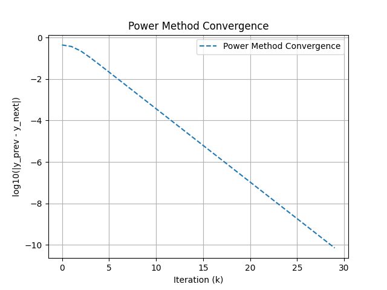
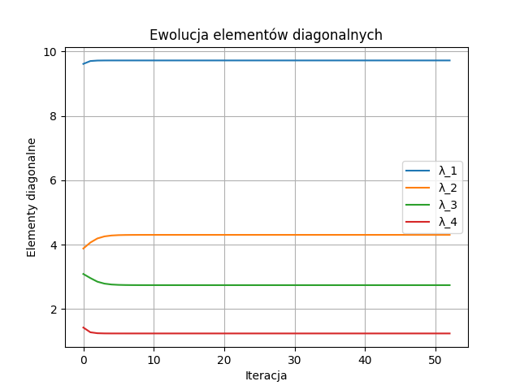
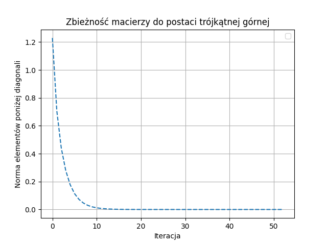

## Cel

Zadana jest macierz:

$$
M = \begin{pmatrix}
9&2&0&0\\
2&4&1&0\\
0&1&3&1\\
0&0&1&2
\end{pmatrix}
$$

-   Stosując metodę potęgową znajdź największą co do modułu wartość własną macierzy M oraz odpowiadający jej wektor własny. Na wykresie w skali logarytmicznej zilustruj zbieżność metody w funkcji ilości wykonanych iteracji.
-   Stosując algorytm QR bez przesunięć, znajdź wszystkie wartości własne macierzy M. Sprawdź, czy macierze $A_i$ upodabniają się do macierzy trójkątnej górnej w kolejnych iteracjach. Przeanalizuj i przedstaw na odpowiednim wykresie, jak elementy diagonalne macierzy $A_i$ ewoluują w funkcji indeksu $i$.
-   Zastanów się, czy zbieżność algorytmu z pprzednich pkt. jest zadowalająca. Jak można usprawnić te algorytmy? Wyniki sprawdź używając wybranego pakietu algebry komputerowej lub biblioteki numerycznej.

## Wstęp teoretyczny

### Metoda potęgowa

Niech $A ∈ R^{N×N}$ będzie macierzą symetryczną, $A = A^T$ . Wiadomo,
ze macierz taka jest diagonalizowalna, ma rzeczywiste wartości własne, a jej unormowane wektory własne tworzą bazę ortonormalną w $R^N$. Niech bazą tą będzie ${ei}^N_{i=1}$, przy czym $Ae_i = λ_ie_i$. Przyjmijmy dodatkowo,
ze wartości własne macierzy A są dodatnie i uporządkowane $λ_1 > λ_2 >
· · · > λ_N > 0$.

Weźmy wektor $y ∈ R^N$. Posiada on rozkład

$$
y = \sum^N_{i=1}β_ie_i
$$

Obliczamy

$$
Ay = A\sum^N_{i=1}β_ie_i = \sum^N_{i=1}β_iAe_i = \sum^N_{i=1}β_i\lambda_i e_i
$$

$$
A^2y = A^2\sum^N_{i=1}β_ie_i = \sum^N_{i=1}β_iA^2e_i = \sum^N_{i=1}β_i\lambda_i^2 e_i
$$

$$
...
$$

$$
A^{(k)}y = A^{(k)}\sum^N_{i=1}β_ie_i = \sum^N_{i=1}β_iA^{(k)}e_i = \sum^N_{i=1}β_i\lambda_i^{(k)} e_i
$$

Widzimy, ze dla dostatecznie dużych k wyraz zawierający $λ_1^k$ będzie dominował w sumie po prawej stronie, pozostałe współczynniki będą zaniedbywalnie małe, a zatem prawa strona dla dostatecznie dużych k będzie dązyć do wektora proporcjonalnego do $e_1$, czyli do wektora własnego do największej wartosci własnej.

A zatem iteracja ($||y_1|| = 1$, poza tym dowolny):

$$
Ay_k = z_k
$$

$$
y_{k+1} = \frac{z_k}{||z_k||}
$$

Gdy iteracja zbiegnie się do punktu stałego (kolejne wektory $y_k \approxeq e_1$ przestaną się zauwazalnie zmieniać), wartość własną obliczamy jako $λ_1 = ||z_k||$.

### Algorytm QR

Niech macierz $A$ posiada faktoryzację QR, $A = QR$. Rozważmy iloczyn tych czynników wziętych w odwrotnej kolejności:

$$
A' = RQ = Q^T A Q.
$$

Widzimy, że wymnożenie czynników faktoryzacji QR w odwróconej kolejności stanowi ortogonalną transformację podobieństwa macierzy $A$.

---

### Iteracja algorytmu QR

Procedurę tę można iterować, zaczynając od $A_1 = A$ :

$$
A_1 = Q_1 R_1,
$$

$$
A_2 = R_1 Q_1 = Q_2 R_2,
$$

$$
A_3 = R_2 Q_2 = Q_3 R_3,
$$

$$
\vdots
$$

$$
A_n = R_{n-1} Q_{n-1} = Q_n R_n
$$

Każda prawa strona $Q_k R_k$reprezentuje faktoryzację QR dokonywaną w $k$-tym kroku iteracji. Macierz $A_n$ jest ortogonalnie podobna do macierzy $A$.

---

### Właściwości algorytmu QR

1. Algorytm zachowuje:

    - Symetrię macierzy,
    - Postać trójdiagonalną symetryczną,
    - Postać Hessenberga.

2. Zachodzi następujące twierdzenie:

**Twierdzenie:**
Jeżeli macierz $A$ jest diagonalizowalna i jej wszystkie wartości własne są rzeczywiste oraz parami różne od siebie, to iteracja:

$$
A_k = R_{k-1} Q_{k-1}
$$

jest zbieżna do macierzy trójkątnej górnej, w której na głównej przekątnej znajdują się kolejne wartości własne macierzy $A$.

## Znalezienie największej wartości własnej macierzy M metodą potęgową

Macierz M jest symetryczna, a jej elementy należą do zbioru liczb rzeczywistych, możemy więc zastosować metodę potęgową.

Program stosujący tą metodę dostępny jest w pliku `power.py`.
Z jego pomocą obliczono wektor własny $e_1$ i odpowiadającą mu warość własną $\lambda _1$ macierzy $M$.

$$
e_1 =
\begin{pmatrix}
0.93984758 \\
0.33766292\\
0.05124654\\
0.0066394
\end{pmatrix}
$$

$$
||e_1|| = 1
$$

$$
\lambda _1 =
9.718548254119627
$$

Sprawdzono również zbieżność metody w zależności od liczby wykonanych iteracji.

Metoda Potęgowa uzyskała największą wartość własną w prawie 30 iteracjach dla macierzy 4x4, a była to wartość własna najbardziej różniąca się wielkością od pozostałych. Sugeruje to, że zbieżność metody do obliczania kolejnych wartości własnych będzie jeszcze wolniejsza.

## Znalezienie wartości własnych algorytmem QR

Program stosujący tą metodę dostępny jest w pliku `qr.py`.
Z jego pomocą obliczono wartości własne $\lambda _i$ macierzy $M$.

$$
\begin{pmatrix}
\lambda _1 \\
\lambda _2\\
\lambda _3\\
\lambda _4
\end{pmatrix} = \begin{pmatrix}
9.71854825 \\4.30170491\\ 2.74019411\\ 1.23955273
\end{pmatrix}
$$

Wyznaczona w ten sposób pierwsza wartość własna jest zgodna z tą wyznaczoną w poprzedniej metodzie.

Na wykresie zobrazowano jak zmieniały się wszystkie wartości własne w kolejnych iteracjach:

Ponieważ wartości własne na diagonali macierzy $M$ są już bliskie rzeczywistym wartościom w trakcie wczesnych iteracji, to dalsza zbieżność jest bardzo powolna.

Przedstawiono również zmiany elementów poddiagonalnych podczas wykonywania iteracji.

Widać wyraźnie że wraz z kolejnymi iteracjami zbiegały one do 0.

Macierz $A_{50}$ miała postać:

$$
A = \begin{pmatrix} 9.71854825  & 1.17334237 \cdot 10^{-16}& -3.23120854 \cdot 10^{-17} & 5.89307528 \cdot 10^{-17}\\
  2.95900848 \cdot 10^{-18}&4.30170491 &2.73053629 \cdot 10^{-10} &-2.15717460 \cdot 10^{-16}\\
  0.0 &2.73053128 \cdot 10^{-10}&2.74019411  &-1.51992527 \cdot 10^{-16}\\
  0.0 &0.0 &6.59273312 \cdot 10^{-18}&1.23955273 \end{pmatrix}
$$

zatem elementy ponad 1 pasmem nad diagoinalą stały się niezerowe (wciąż pozostały jdnak znikomo małe w porównaniu z elementami diagonalnymi), z kolei elementy leżące na pasmech bezpośrednio ponad i pod diagonalą znacznie zmalały. Poddiagonalne elementy równe 0 pozostały zerowe.

## Zbieżność algorytmu QR i metody potęgowej

1. Zbieżność metody potęgowej

Metoda potęgowa jest stosunkowo szybka, gdy chodzi o znajdowanie największej wartości własnej, szczególnie gdy ta wartość jest wyraźnie dominująca w porównaniu do innych. Jednak jej zbieżność jest wolniejsza, gdy różnice między wartościami własnymi są małe. Dla macierzy, w której wartości własne są bliskie siebie, metoda potęgowa może wymagać wielu iteracji, aby osiągnąć wymaganą dokładność. W tym przypadku, jeżeli macierz ma wiele wartości własnych zbliżonych do siebie, zbieżność metody może być znacznie wolniejsza.

Możliwości poprawy:

Metoda potęgowa z przesunięciem (shifted power method):
Zastosowanie przesunięcia, czyli zmiany macierzy $A$ na $A - \sigma I$ (gdzie $\sigma$ to przesunięcie), pozwala przyspieszyć zbieżność, szczególnie jeśli znamy przybliżoną wartość własną.

2. Zbieżność algorytmu QR
   Algorytm QR bez przesunięć jest bardzo efektywny w przypadku macierzy symetrycznych, szczególnie jeśli nie ma dużych różnic w wartościach własnych. Zbieżność jest zazwyczaj szybka, ale w przypadku macierzy o licznych wartościach własnych bliskich siebie, wymaga on wielu iteracji. W praktyce, mimo iż algorytm jest teoretycznie zbieżny, czasami może wymagać wielu iteracji, by otrzymać dokładne wartości własne.

Możliwości poprawy:

QR z przesunięciem: Zastosowanie przesunięcia w algorytmie QR może znacznie przyspieszyć zbieżność. W takim przypadku faktoryzacja QR jest wykonywana na macierzy $A_k - \sigma I = Q_kR_k$. Następie dodaje się przesunięcie do kolejnego kroku iteracji $A_{k+1} = R_kQ_k + \sigma I$. Prowadzi do szybszego zbiegania macierzy do postaci trójkątnej górnej. Konsekwencją wyboru algorytmu z przesunięciami wartości własnych jest brak uporządkowania wartości własnych na diagonali.

### Podsumowanie

W zadaniu zastosowano dwie metody obliczania wartości własnych macierzy: metodę potęgową oraz algorytm QR. Macierz $M$ jest symetryczna i rzeczywista, co pozwoliło na użycie tych algorytmów.

-   Metoda potęgowa:

Użyta do obliczenia największej wartości własnej. Zbieżność metody była stosunkowo szybka, ale dla macierzy z wartościami własnymi zbliżonymi do siebie może być wolniejsza. Największa wartość własna wyniosła:
$\lambda _1 \approx 9.71854825$, a odpowiadający jej wektor własny to:

$$
e_1 =
\begin{pmatrix}
0.93984758 \\
0.33766292\\
0.05124654\\
0.0066394
\end{pmatrix}
$$

-   Algorytm QR bez przesunięć:
-   Znaleziono wszystkie wartości własne macierzy, które wyniosły: $\lambda _1 = 9.71854825$, $\lambda _2 =4.30170491$, $\lambda _3 = 2.74019411$, $\lambda _4 = 1.23955273$. Zbieżność tego algorytmu była powolna, ale zapewniła wszystkie wartości własne. Wartości na diagonali zaczęły się stabilizować już w pierwszych iteracjach, a elementy poddiagonalne zbiegały do zera.

Wniosek:

Zarówno metoda potęgowa, jak i algorytm QR są skuteczne, ale ich zbieżność można poprawić przez zastosowanie przesunięć, szczególnie w przypadku macierzy o wielu wartościach własnych bliskich siebie.
