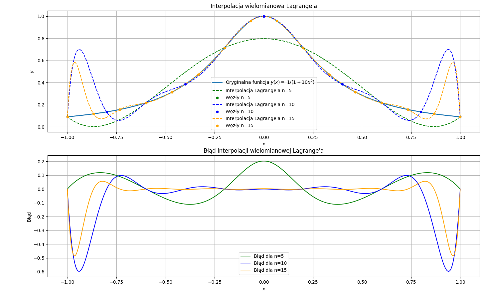
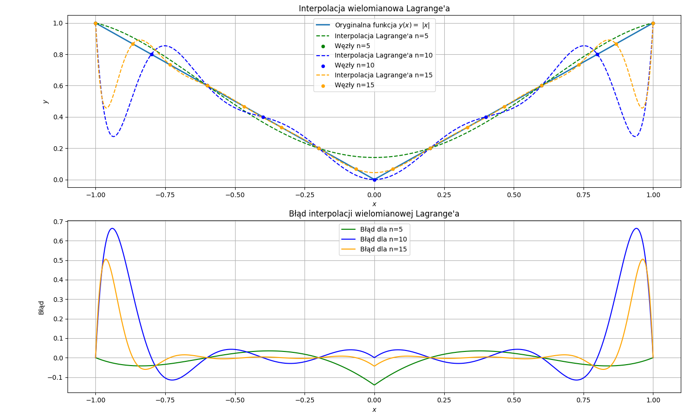
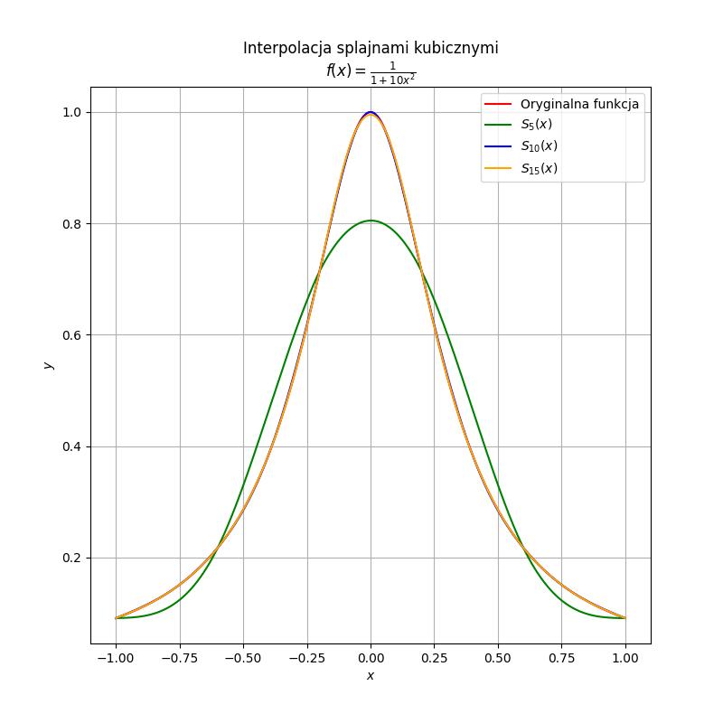
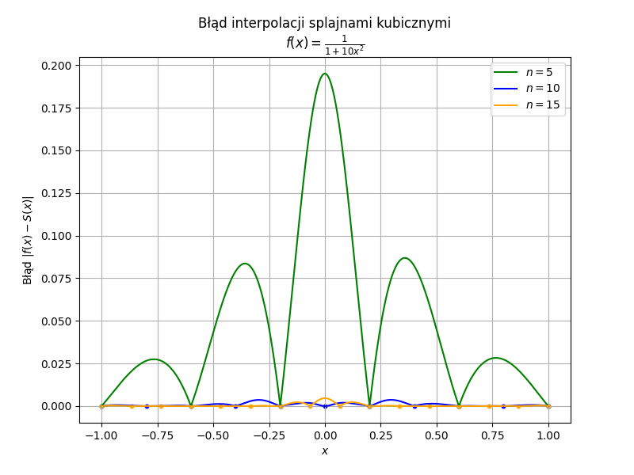
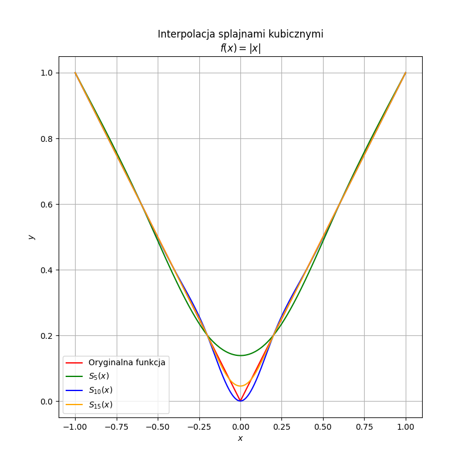
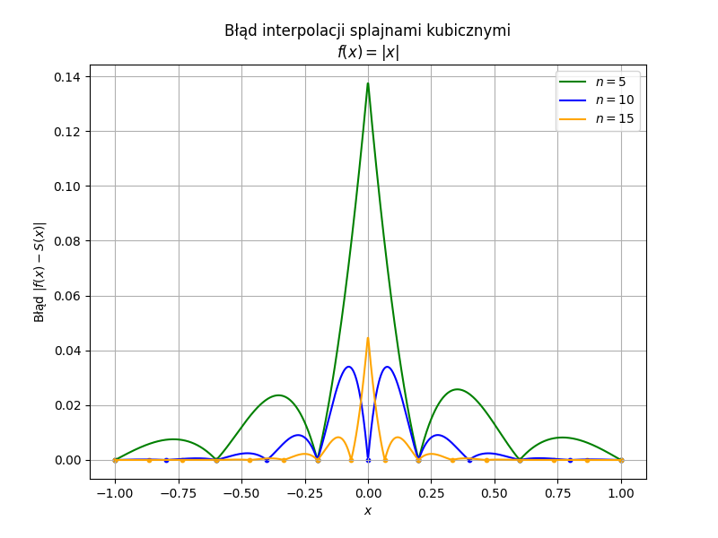

## Cel

Rozważmy funkcję $y(x) = \frac{1}{1+10x^2}$ , zadaną na przedziale $x \epsilon [−1, 1]$.
Wygeneruj zbiór punktów ${(x_i
, y_i)}$, gdzie $x_i = −1 + 2\frac{i}{n}$,
$(i = 0, . . . , n)$ jest jednorodną siatką punktów, a
$y_i ≡ y(x_i)$. Dla tych danych wygeneruj:

(a) wielomian interpolacyjny stopnia $\leq n$,

(b) funkcję sklejaną stopnia trzeciego, $s(x)$, spełniającą warunki $s''(x_0) = s''(x_n) = 0$.

Wyniki porównaj z zaproponowaną funkcją y(x) na wykresie, dla różnej ilości punktów n. W szczególności
interesujące są różnice $y(x)−Wn(x)$ oraz $y(x)−s(x)$ pomiędzy węzłami interpolacji. Przeprowadź również
podobną analizę dla innych funkcji. Czy nasuwają się jakieś wnioski?

## Wstęp teoretyczny

## Wielomian interpolacyjny stopnia $\leq n$

Rozpatrzmy wielomian:

$$
Wn(x) = a_{n-1}x^{n-1} + a_{n-2}x^{n-2} + ... + a_1x + a_0
$$

Znając wartości funkcji w punktach $x_i$ możemy je kolejno podstawiać do wielomianu w celu wyliczenia jego współczynników $a_i$.

Otrzymamy wtedy następujący układ równań:

$$

\begin{pmatrix}
x_1^{n-1} & x_1^{n-2} & ... & x_1 & 1 \\
x_2^{n-1} & x_2^{n-2}& ... & x_2 & 1 \\
... & ... & ... & ... & ...\\
x_n^{n-1} & x_n^{n-2}& ... & x_n & 1\\
\end{pmatrix} \cdot \begin{pmatrix}
a_{n-1} \\
a_{n-2}\\
...\\
a_0\\
\end{pmatrix} =  \begin{pmatrix}
y_1 \\
y_2\\
...\\
y_n\\
\end{pmatrix}
$$

Rozwiązaniem układu równań są współczynniki wielomianu. Macierz $X$ układu nosi nazwę macierzy Vandermonde’a.
Ponieważ jej wiersze i kolumny są liniowo niezależne, (żadne węzły interpolacji się nie pokrywają), macierz ta ma wyznacznik różny od zera.

### Wzór interpolacyjny Lagrange’a

Zamiast szukać rozwiązania tego równania, postulujemy, że poszukiwany
wzór interpolacyjny ma postać:

$$
y(x) = \sum_{j=1}^n l_j(x)y_j + E(x)
$$

gdzie

$$
l_j(x) = \frac{(x-x_1)...(x-x_{j-1})(x-x_{j+1})...(x-x_n)}{(x-x_1)...(x_j-x_{j-1})(x_j-x_{j+1})...(x_j-x_n)}
$$

$$
l_j(x_k) = \delta_{jk}
$$

$E(x)$ jest nazwywane resztą lub błędem interpolacji, znika tożsamościowo jeżeli $f(x)$ jest wielomianem stopnia co najwyżej $n-1$.

## Interpolacja funkcją sklejaną stopnia trzeciego

W każdym przedziale $[x_j,x_j+1], j \epsilon [1,2,...,n-1]$ , konstruujemy wielomian trzeciego stopnia:
(wielkosci $\xi_i$ będą drugimi pochodnymi wyrażenia interpolacyjnego w węzłach).

$$
s_j(x) = Ay_j + By_{j+1} + C \xi_j + D \xi_{j+1}
$$

gdzie :

$$
A = \frac{x_{j+1} - x}{x_{j+1} - x_j}
$$

$$
B = \frac{x - x_j}{x_{j+1} - x_j}
$$

$$
C = \frac{1}{6}(A^3-A)(x_{j+1} - x_j)^2
$$

$$
D =\frac{1}{6}(B^3-B)(x_{j+1} - x_j)^2
$$

Jezeli węzły interpolacji są równoodległe ($x_{j+1} - x_j = h$), a $s''(x_0) = s''(x_n) = 0$,
kolejne wartości $\xi_i$ możemy wyznaczyć jako:

$$

\begin{pmatrix}
4 & 1 &  &... & &  \\
1 & 4 &  1 &... & &  \\
... & ... &... & ... & ... & ...\\
 & & &... & 1 & 4\\
\end{pmatrix} \cdot \begin{pmatrix}
\xi_2 \\
\xi_3\\
...\\
\xi_{n-1}\\
\end{pmatrix} = \frac{6}{h^2} \begin{pmatrix}
y_1 - 2y_2 + y_3 \\
y_2 - 2y_3 + y_4\\
...\\
y_{n-2} - 2y_{n-1} + y_n\\
\end{pmatrix}
$$

Do rozwiązania tego układu równań można posłużyć się faktoryzacją Cholesky'ego.

## Interpolacja wielomianowa za pomocą programu

Za pomocą funkcji `polynomial(n)` znajdującej
się w pliku `wielomian.py` wyznaczono wielomian interpolacyjny dla zadanego zbioru punktów.

Dla 5 węzłów interpolacja pomiędzy węzłami najsłabiej oddaje faktyczną funkcję. Dla większej liczby węzłów interpolacja wykazuje dobrą zgodność z funkcją w obrębie węzłów. Jednakże w miarę zwiększania liczby węzłów, pojawia się problem oscylacji pomiędzy węzłami, co prowadzi do zniekształcenia wykresu w innych częściach przedziału.

Sprawdzono również program dla innej funkcji, $f(x) = |x|$:

Dla tej funkcji wielomian Lagrange'a ma trudności z dokładnym odwzorowaniem jej kształtu, szczególnie w okolicach punktu $x=0$, gdzie funkcja jest nieciągła. Zwiększanie liczby węzłów poprawia dopasowanie, ale nadal występują oscylacje na brzegach.

## Interpolacja splajnami kubicznymi

Za pomocą programu znajdującego
się w pliku `splajn.py` przeprowadzono interpolację tej funkcji za pomocą splajnów kubicznych.

Interpolacja za pomocą splajnów kubicznych wykazuje znacznie lepsze rezultaty niż interpolacja wielomianowa. Dla 5 punktów skuteczność jest co prawda wciąż niska,
ale dla 10 i 15 przybliżenie jest bardzo dobre.
Splajny zapewniają gładkość pierwszej i drugiej pochodnej, co sprawia, że interpolacja jest bardziej stabilna i nie wykazuje oscylacji.

Błędy w interpolacji splajnami kubicznymi są mniejsze i mniej wrażliwe na liczbę węzłów, w porównaniu do interpolacji wielomianowej, co czyni tę metodę bardziej odpowiednią do interpolacji funkcji, które mają zmienną krzywiznę. Błąd rośnie w miarę oddalania się od węzła, i maleje w miarę przybliżania się do kolejnego.

Metodę przetestowano również dla innej funkcji, $f(x) = |x|$:

Ponownie dokładność dopasowania rosła zgodnie z liczbą węzłów

Największe błędy wystąpiły w obszarze nieciągłości $x=0$.

## Wnioski

Interpolacja splajnami kubicznymi jest preferowaną metodą w przypadkach, gdzie dokładność i stabilność interpolacji są kluczowe, zwłaszcza dla funkcji nieliniowych o zmiennych krzywiznach. Pozwala na obliczenia z wykorzystaniem większej liczby węzłów.
Interpolacja wielomianowa jest bardziej podatna na błędy numeryczne, zwłaszcza przy dużych liczbach węzłów, i może prowadzić do niepożądanych oscylacji Rungego w przypadku funkcji o bardziej złożonych kształtach.
