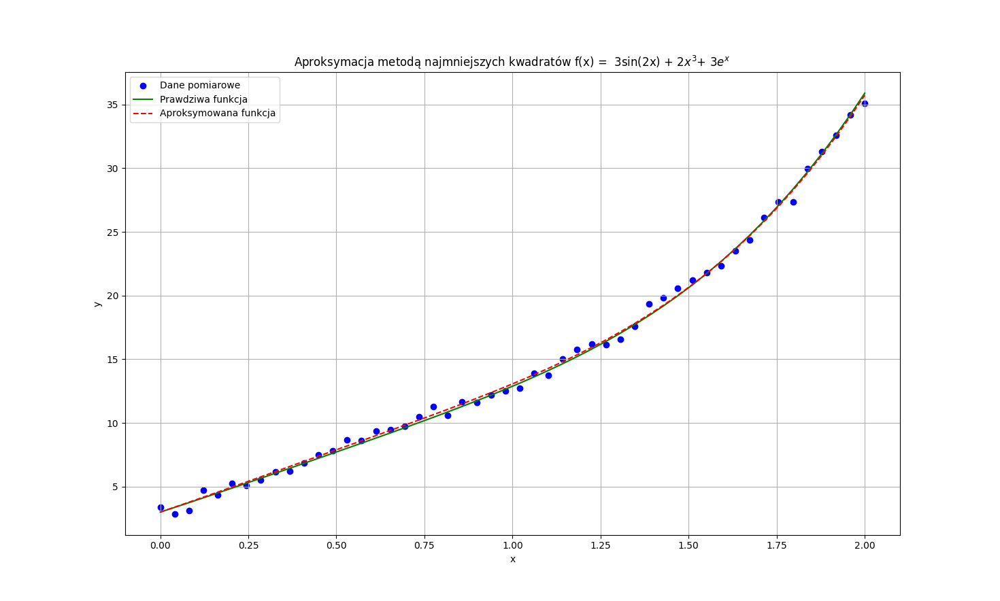
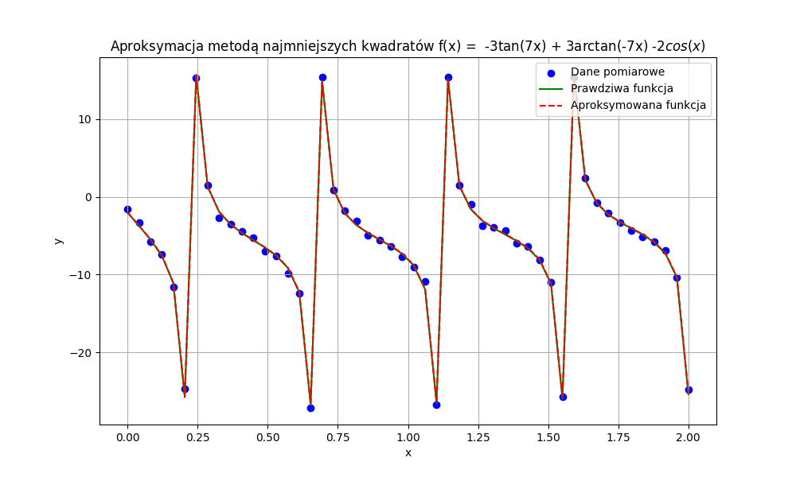
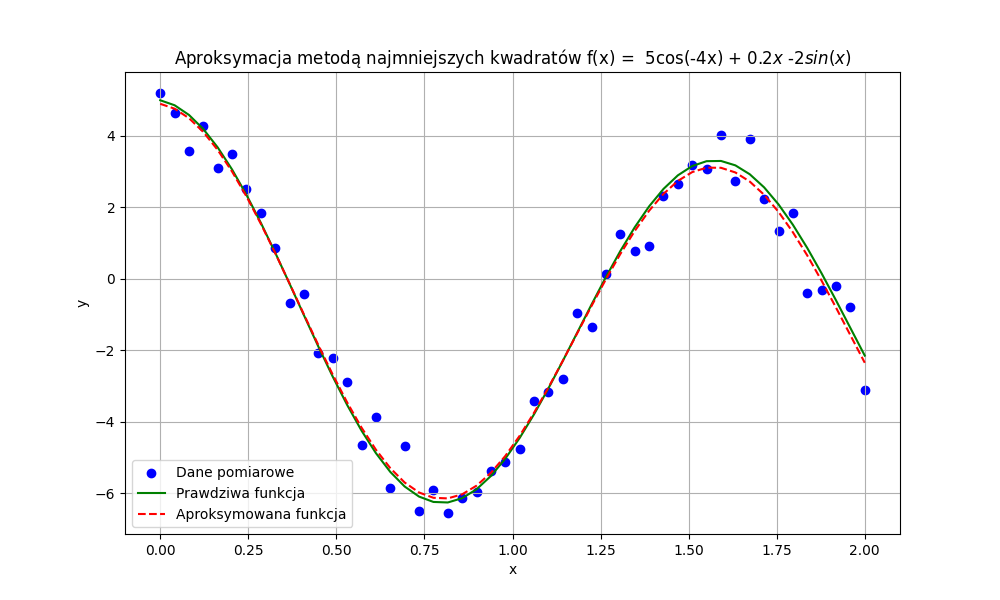
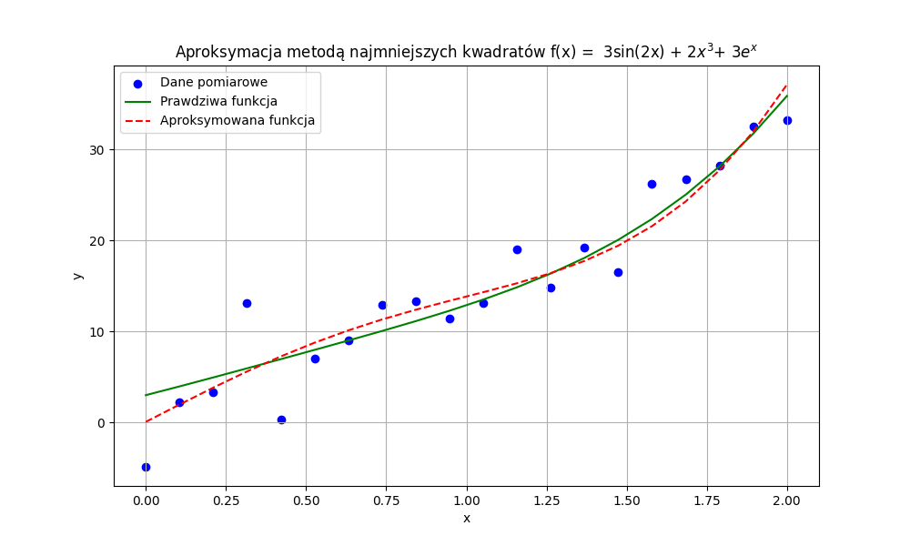
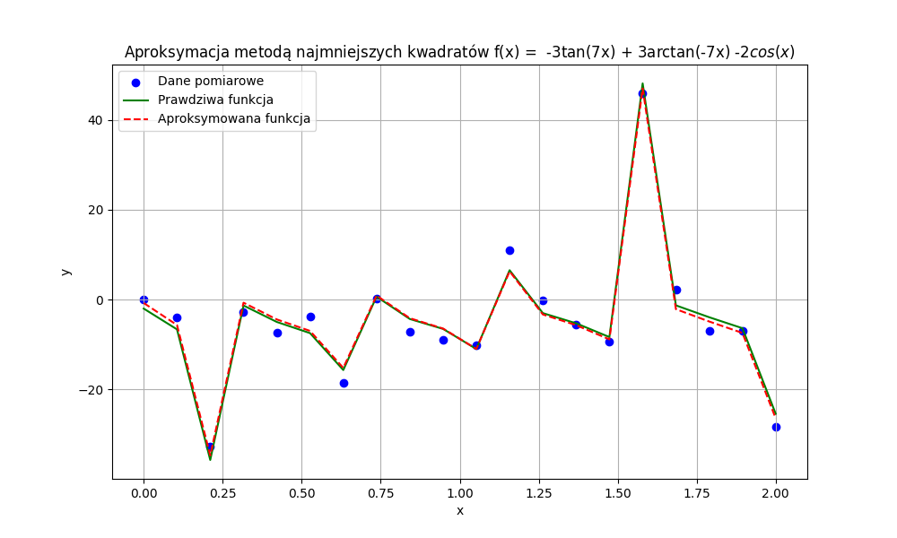
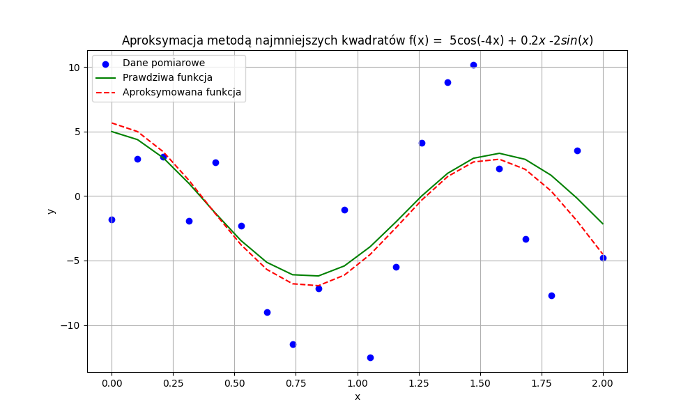

## Cel

Zaproponuj wielomian uogólniony w postaci $F(x) = \sum^m_{j=1} a_jφ_j(x)$,
gdzie ilość parametrów $m \geqslant 3$, a $φ_j(x)$ są pewnymi funkcjami. Zdefiniuj siatkę punktów $x_i$ oraz (dla
pewnego ustalonego zestawu parametrów $a_j$ ) wygeneruj dane w postaci ${(x_i
, y_i)}$, gdzie i = 1, . . . , n, a
$y_i = F(x_i) + δy_i$. Zaburzenia $δy_i$ należy losować z rozkładu normalnego z odchyleniem standardowym $σ$.
(a) Znajdź wartości współczynników $a_j$ , dla których funkcja $F(x)$ najlepiej opisuje zaburzone dane w
sensie metody najmniejszych kwadratów. Rezultat przedstaw graficznie dla kilku wyborów wielkości
siatki, n, oraz odchylenia standardowego, σ.
(b) Przeanalizuj różnicę pomiędzy wcześniej ustalonymi współczynnikami, a ich wartościami uzyskanymi
w procedurze aproksymacji przeprowadzonej dla zaburzonych danych.

## Wstęp teoretyczny

#### Liniowe zagadnienie najmniejszych kwadratów

Każdej zmierzonej (i obarczonej błędem) wartości $y_i$ odpowiada wartość
teoretyczna $\tilde{y}_i$, jaką zmienna y “powinna” przybrać dla danej wartości zmiennej x. Przyjmujemy, ze wartość teoretyczna jest kombinacją liniową pewnych znanych funkcji:
$$\tilde{y}_i = a_1 · f_1(x_i) + a_2 · f_2(x_i) + · · · + a_s · f_s(x_i)$$
Zespół wszystkich wartosci teoretycznych mżemy zatem przedstawić jako:

$$
\tilde{y} = \begin{pmatrix}
f_1(x_1) & f_2(x_1) & ... & f_s(x_1) \\
f_1(x_2) & f_2(x_2)& ... & f_s(x_2)\\
... & ... & ... & ...\\
f_1(x_n) & f_1(x_n)& ... &f_s(x_n)\\
\end{pmatrix} \cdot
\begin{pmatrix}
a_1\\
a_2\\
...\\
a_s\\
\end{pmatrix} = Ap
$$

Problemem numerycznym, który chcemy rozwiązać, jest znalezienie “najlepszego” wektora parametrów $a_i$.

Oznaczmy wektor wszystkich błędów pomiarowych przez
$ξ = [ξ_1, ξ_2, . . . , ξ_n]^T$. Dalej, przyjmijmy, ze łącznie wszystkie błędy ˙
tworzą n-wymiarowy rozkład Gaussa o macierzy kowariancji G:
$<ξξ^T>= G$ ,
gdzie $<...>$ oznacza sredniowanie po realizacjach zmiennych losowych.
Macierz G jest symetryczna i dodatnio okreslona.

#### Metoda najmniejszych kwadratów

Twierdzenie 1. Jeżeli błędy pomiarowe pochodą z rokładu Gaussa o macierzy kowariancji G, estymator największej wiarygodnosci odpowiada minimum formy kwadratowej
$Q = \frac{1}{2}ξ^TG^{−1}ξ$

#### Minimum formy kwadratowej

Aby znaleźć estymator, należy znaleźć taki wektor p, że forma kwadratowa przybiera najmniejszą mozliwą wartość. Można to zrobić albo
bezposrednio, metodą zmiennej metryki lub gradientów sprzężonych, albo
formalnie rozwiązując równanie $∇Q = 0$, gdzie rózniczkujemy po składowych wektora p. Otrzymujemy:
$$A^TG{−1}Ap = A^TG^{−1}y$$

Zamiast minimalizowac formę kwadratową, moglibśmy zaządać, aby
równanie $y_i = \tilde{y}_i$ było sciśle spełnione dla wszystkich punktów pomiarowych $(x_i,y_i)$.
$$Ap = y$$
Jest to nadokreślony układ równan, metoda SVD (Singular Value Decomposition) dostarcza przyblizonego rozwiązania takich układów, optymalnego w sensie najmniejszych kwadratów.

## Rozwiązanie programem

Rozwiązanie znajduje się w pliku `program.py`.

#### n = 50 ,$\sigma$ = 0.5

Zaproponowany wielomian w postaci $F(x) = 3sin(2x) + 2x^3 + 3e^x$
,n = 50
,$\sigma$ = 0.5

Prawdziwy wektor współczynników $a = \begin{pmatrix}
3 & 2 & 3
\end{pmatrix}^T$

Estymowany wektor współczynników $a' = \begin{pmatrix}
3.19838856 & 1.99334262 & 3.00573671
\end{pmatrix}^T$

Różnica: $a-a' = \begin{pmatrix}
-0.19838856 & 0.00665738 & -0.00573671
\end{pmatrix}^T$

Zaproponowany wielomian w postaci $F(x) = -3tan(7x) + 3arctan(-7x) - 2 cos(x)$
,n = 50
,$\sigma$ = 0.5

Prawdziwy wektor współczynników $a = \begin{pmatrix}
-3 & 3 & -2
\end{pmatrix}^T$

Estymowany wektor współczynników $a' = \begin{pmatrix}
-2.98055277 & 2.97232138 & -2.00910849
\end{pmatrix}^T$

Różnica: $a-a' = \begin{pmatrix}
-0.01944723 & 0.02767862 & 0.00910849
\end{pmatrix}^T$

Zaproponowany wielomian w postaci $F(x) = 5cos(-4x) + 0.2x - 2sin(x)$
,n = 50
,$\sigma$ = 0.5

Prawdziwy wektor współczynników $a = \begin{pmatrix}
5 & 0.2 & -2
\end{pmatrix}^T$

Estymowany wektor współczynników $a' = \begin{pmatrix}
4.90023178 & -0.03819615 & -1.71258978
\end{pmatrix}^T$

Różnica: $a-a' = \begin{pmatrix}
0.09976822 & 0.23819615 & -0.28741022
\end{pmatrix}^T$

#### n = 20 ,$\sigma$ = 4

Zaproponowany wielomian w postaci $F(x) = 3sin(2x) + 2x^3 + 3e^x$
,n = 20
,$\sigma$ = 4

Prawdziwy wektor współczynników $a = \begin{pmatrix}
3 & 2 & 3
\end{pmatrix}^T$

Estymowany wektor współczynników $a' = \begin{pmatrix}
9.05722428 & 5.44282891 & 0.06156283
\end{pmatrix}^T$

Różnica: $a-a' = \begin{pmatrix}
-6.05722428 & -3.44282891 & 2.93843717
\end{pmatrix}^T$

Zaproponowany wielomian w postaci $F(x) = -3tan(7x) + 3arctan(-7x) - 2 cos(x)$
,n = 20
,$\sigma$ = 4

Prawdziwy wektor współczynników $a = \begin{pmatrix}
-3 & 3 & -2
\end{pmatrix}^T$

Estymowany wektor współczynników $a' = \begin{pmatrix}
-2.97481740 & 3.45513845 & -0.75796309
\end{pmatrix}^T$

Różnica: $a-a' = \begin{pmatrix}
-0.02518260 & -0.45513845 & -1.24203691
\end{pmatrix}^T$

Zaproponowany wielomian w postaci $F(x) = 5cos(-4x) + 0.2x - 2sin(x)$
,n = 20
,$\sigma$ = 4

Prawdziwy wektor współczynników $a = \begin{pmatrix}
5 & 0.2 & -2
\end{pmatrix}^T$

Estymowany wektor współczynników $a' = \begin{pmatrix}
5.66713443 & -1.99170010 & 0.33434865
\end{pmatrix}^T$

Różnica: $a-a' = \begin{pmatrix}
-0.66713443 & 2.19170010 & -2.33434865
\end{pmatrix}^T$

## Wnioski

Dokładność procedury aproksymacji ściśle zależy od ilości punktów i odchylenia standarowego. Im mniej punktów bądź większe odchylenie standardowe, tym wyniki są bardziej oddalone od stanu faktycznego.

Metoda dekompozycji SVD pozwoliła na skuteczne oszacowanie współczynników funkcji. Różnice przy dokładniejszych danych (więcej punktów, mniejsze odchylene) pomiędzy estymowanymi współczynnikami a rzeczywistymi wartościami są niewielkie, co świadczy o dobrej stabilności i dokładności metody najmniejszych kwadratów w zastosowanym podejściu.
